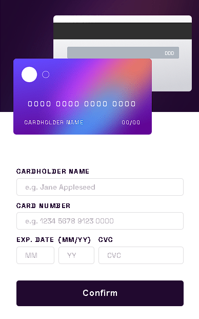
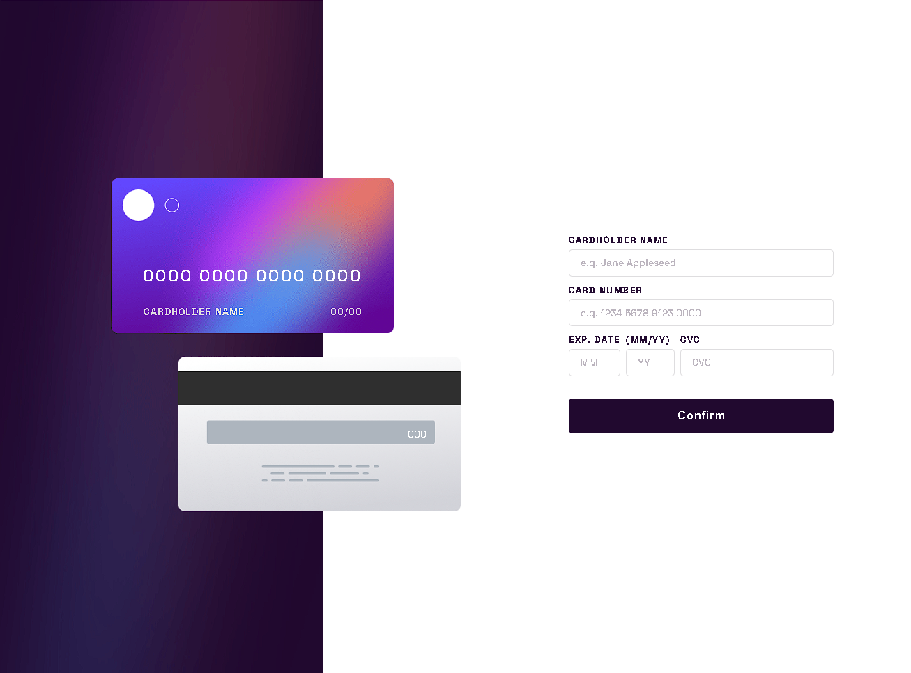

# Interactive Card
Uma página com formulários para preencher que atualizam em tempo real as informações do cartão na tela.

## DETALHES DO PROJETO:
O Objetivo principal do projeto foi desenvolver uma página de compra online,
onde o usuário introduz as informações do cartão de crédito nos formulários
e automaticamente estas informações são alteradas no cartão que aparece em tela.

## Disponível para desktop e mobile!
O projeto foi desenvolvido com responsividade conseguindo se adequar tanto para telas
de mobile quanto para telas desktop.

## Foto do Projeto para mobile

## Foto do Projeto para desktop

## TECNOLOGIAS USADAS NO PROJETO:
* HTML
* CSS
* JavaScript
